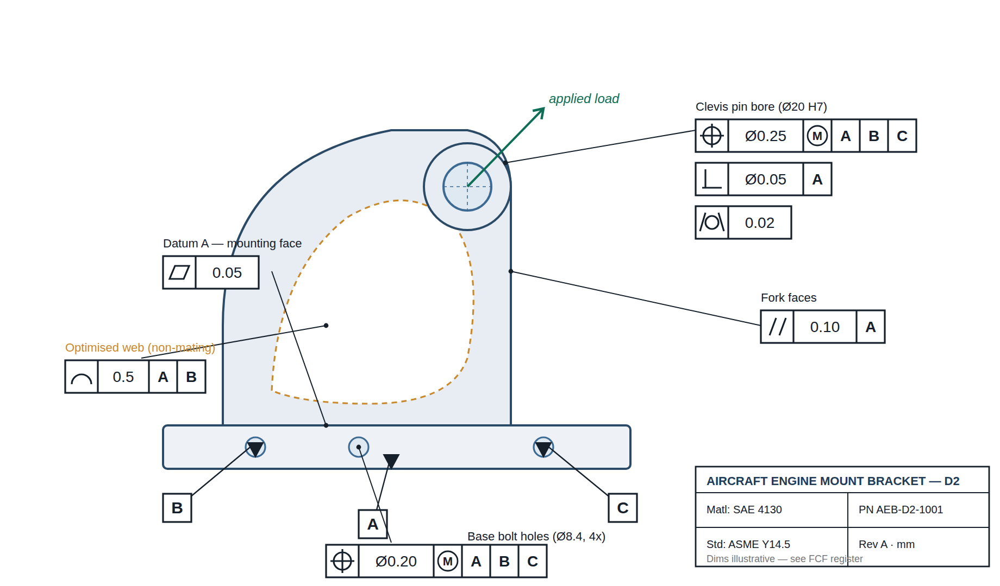

# Aircraft Engine Mount Bracket — FEA, Topology Optimisation & GD&T

Structural finite element analysis, topology optimisation and full GD&T /
tolerance definition of an aircraft engine mount bracket (SAE 4130) — taking
the part from validated simulation to a manufacturable, inspectable,
production-ready design.

**MSc Dissertation, University of Salford** · extended with a self-initiated
GD&T, tolerance-management and PLM workflow.

`ANSYS Mechanical` · `CATIA V5` · `ASME Y14.5-2018` · `Siemens Teamcenter`

---

## Overview

The engine mount bracket is a flight-critical structural component that carries
engine loads into the airframe. This project:

1. Models and validates the bracket under representative aerospace load cases (**FEA / V&V**)
2. Reduces mass while preserving structural integrity (**topology optimisation**)
3. Converts the optimised geometry into a controlled, manufacturable definition
   (**GD&T + tolerance stack-up**)
4. Manages the part through its lifecycle from CAD to release (**Teamcenter PLM**)

The full arc — **analysis → optimisation → producible design** — is the closed-loop
V-Model workflow used in industry.

---

## 1 · Structural FEA & Verification

- Two candidate designs modelled in CATIA V5 / Creo and analysed in ANSYS Mechanical
- Evaluated across multiple structural load cases (vertical, horizontal, combined)
  plus **modal / vibration analysis** (first 5 natural frequencies)
- Tetrahedral mesh with refinement at fastener holes and stress-concentration zones;
  grid-independence study performed
- Outputs (equivalent stress, shear stress, total deformation, FOS) benchmarked
  against aerospace loading standards (V&V)

**Material:** SAE 4130 (chromoly steel), yield strength 460 MPa

### Design comparison (key results)

| Parameter | Design 1 | Design 2 (selected) |
|---|---|---|
| Max equivalent stress (worst case) | 365.3 MPa | 158.1 MPa |
| Max deformation | 0.124 mm | 0.033 mm |
| Factor of safety | 1.25 | 2.91 |

Design 2 was carried forward — significantly lower stress, deformation and a
healthier factor of safety.

---

## 2 · Topology Optimisation

- Mass-minimisation subject to stress and displacement constraints
- Optimised design re-analysed under the same load cases to confirm integrity

| Metric | Result |
|---|---|
| Mass (generic → optimised) | 3.259 kg → 2.54 kg |
| **Mass reduction** | **~22%** |
| Optimised max equivalent stress | ~266 MPa (within limits) |
| Optimised factor of safety | ~1.73 |

---

## 3 · GD&T & Tolerance Analysis (Extension)

Extended the topology-optimised geometry into a fully manufacturable, inspectable
definition per **ASME Y14.5-2018**.



- **Datum reference frame:** A | B | C (3-2-1) — A = base mounting face,
  B & C = base locating holes
- **Controls applied:** Flatness · Position (MMC) · Perpendicularity ·
  Cylindricity · Parallelism · Profile of a surface
- **Tolerance stack-up:** 1D worst-case (±0.35 mm) vs RSS (±0.206 mm) on the
  pin-bore height above Datum A — RSS band stays inside the mating-clevis allowance
- **Fastener fit:** floating-fastener rule sets position Ø0.20 Ⓜ; MMC bonus gives
  up to Ø0.40 allowable; virtual condition (Ø8.20) proves guaranteed assembly
- **Design principle:** tight controls only on mating / load-path features; the
  non-mating topology-optimised web gets a deliberately loose profile tolerance —
  function-driven tolerancing, not blanket-tight

📄 See [`gdt-tolerance/`](./gdt-tolerance/) for the annotated drawing, the portfolio
one-pager and the full tolerance stack-up workbook (datum scheme, FCF register,
worst-case + RSS stacks, MMC fastener-fit, summary).

---

## 4 · PLM — Siemens Teamcenter

Managed the complete part lifecycle in Siemens Teamcenter:
item & revision control, EBOM structure, dataset management and workflow-based
drawing release — delivering controlled, release-ready engineering data.

---

## Tools & Standards

| Category | Stack |
|---|---|
| FEA & optimisation | ANSYS Mechanical, ANSYS Topology Optimisation |
| CAD | CATIA V5, Creo (Pro/ENGINEER) |
| Standards | ASME Y14.5-2018 (GD&T), MIL-SPEC, V-Model, V&V |
| PLM | Siemens Teamcenter |
| Tolerance analysis | Worst-case + RSS stack-up, MMC / virtual condition |

---

## Repository structure

```
engine-bracket-fea-ansys/
├── README.md
├── fea/                     # FEA setup, load cases, result plots
├── topology-optimisation/   # TO setup and optimised geometry
└── gdt-tolerance/
    ├── GDT_Bracket_Drawing.png          # Annotated GD&T drawing
    ├── GDT_Bracket_OnePager.pdf         # Portfolio one-pager
    └── GDT_Tolerance_Stackup_Bracket.xlsx  # WC + RSS + MMC workbook
```
*(Adapt folder names to match your existing repo layout.)*

---

## Extension & related work

- **ML surrogate model** trained on this FEA data →
  [aircraft-bracket-fea-surrogate](https://github.com/Dineshnae/aircraft-bracket-fea-surrogate)
- [aircraft-flight-dynamics-cessna172](https://github.com/Dineshnae/aircraft-flight-dynamics-cessna172)
- [nlf-airfoil-cfd-xflr5](https://github.com/Dineshnae/nlf-airfoil-cfd-xflr5)
- [twin-boom-uav-design](https://github.com/Dineshnae/twin-boom-uav-design)

---

## Author

**Dinesh Natarajan** — Aerospace Engineer (MSc, University of Salford)
Bengaluru, India
[LinkedIn](https://linkedin.com/in/dinesh-natarajan-baaa95206) ·
dineshnatarajan02@gmail.com
